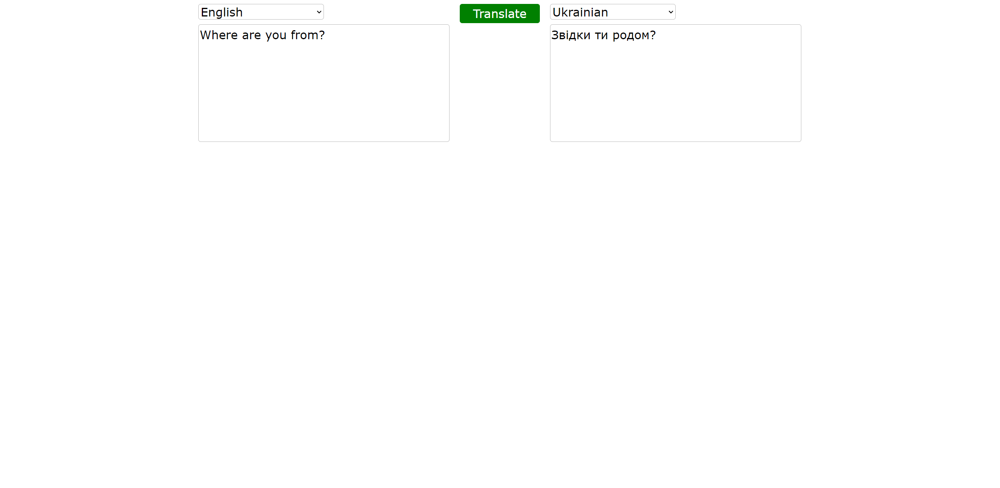
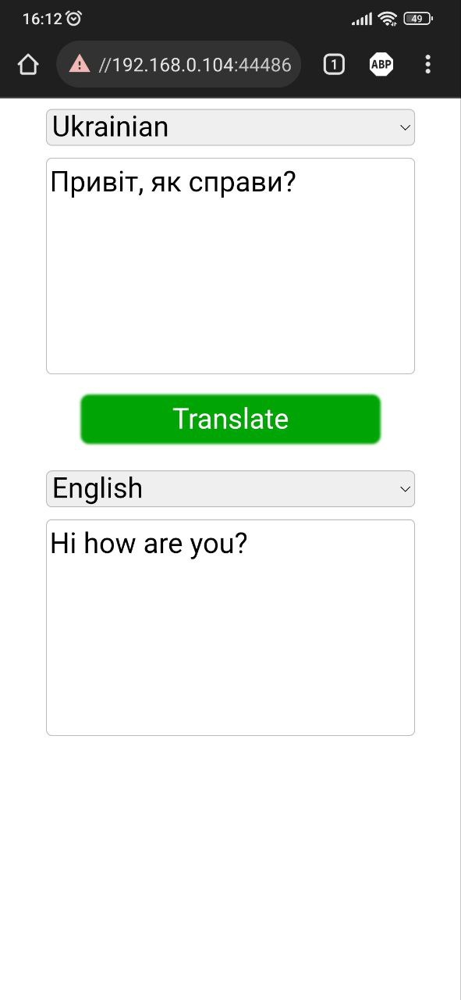

# Simple Translator
This is light-weight simple translation online app where user can translate words and sentences from 135 languages!
Asp.Net Core 7 is used for back-end and React.JS for front-end.
#### Powered by Google Translate API.

#### Desktop user interface: 

#### Mobile user interface:

# Features
- C#
- HTML
- CSS
- Responsive design
- Asp.Net Core 7
- React.js
- Visual Studio 2022 IDE
